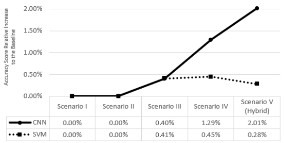

# Hoax Detection on Social Media with Convolutional Neural Network (CNN) and Support Vector Machine (SVM)

## About the Project
This is my Final Project course research for completing my bachelor study. The research is about hoax detection on social media (Twitter) with Convolutional Neural Network (CNN) dan Support Vector Machine (SVM).   
Tools: Google Spreadsheet, Google Colab, Jupyter Notebook  
Programming language: Python

## Dataset
The data was crawled from Twitter using Snscrape library. The research focused on two topics, i.e. Ferdy Sambo Case and Kanjuruhan Tragedy. After all data passed preprocessing, all data labelled with 0 for fact news or 1 for hoax news. Labelling was suppoerted by three person for each news to avoid subjectivity. The distribution of hoax/fact news is represented by table below.

<table>
    <thead>
        <tr>
            <th>Topic</th>
            <th>Category</th>
            <th>Number of Data</th>
        </tr>
    </thead>
    <tbody>
        <tr>
            <td rowspan=2>Kanjuruhan Tragedy</td>
            <td>Fact</td>
            <td>1,279</td>
        </tr>
        <tr>
            <td>Hoax</td>
            <td>1,420</td>
        </tr>
        <tr>
            <td rowspan=2>Ferdy Sambo Case</td>
            <td>Fact</td>
            <td>11,588</td>
        </tr>
        <tr>
            <td>Hoax</td>
            <td>11,038</td>
        </tr>
        <tr>
            <td colspan=2>Total</td>
            <td>25,325</td>
        </tr>
    </tbody>
</table>

## Preprocessing Data
The table below is the preprocessing phases and its example for each phase.

<table>
    <thead>
        <tr>
            <th>Preprocessing Phase</th>
            <th>Text</th>
        </tr>
    </thead>
    <tbody>
        <tr>
            <td>Raw Data</td>
            <td>Ratusan Orang Meninggal dalam Tragedi Kanjuruhan, Tersangkanya Hanya 6</td>
        </tr>
        <tr>
            <td>Data Cleaning</td>
            <td>Ratusan Orang Meninggal dalam Tragedi Kanjuruhan Tersangkanya Hanya</td>
        </tr>
        <tr>
            <td>Case Folding</td>
            <td>ratusan orang meninggal dalam tragedi kanjuruhan tersangkanya hanya</td>
        </tr>
        <tr>
            <td>Stopword Removal</td>
            <td>ratusan orang meninggal tragedi kanjuruhan tersangkanya</td>
        </tr>
        <tr>
            <td>Stemming</td>
            <td>ratus orang tinggal tragedi kanjuruhan sangka</td>
        </tr>
        <tr>
            <td>Tokenizing</td>
            <td>[‘ratus’, ‘orang’, ‘tinggal’, ‘tragedi’, ‘kanjuruhan’, ‘sangka’]</td>
        </tr>
    </tbody>
</table>

## Feature Extraction with TF-IDF
Feature extraction is converting raw data into numeric features so that the data can be processed without losing the true meaning of the original data. TF-IDF is a feature  extraction that is often used in text processing. The way it works depends on converting the space vector representation into a dense continuous vector space, making it possible to find contextual similarities between phrases and words in a particular document.

## Feature Expansion with GloVe
Feature expansion is a method that changes the value of a zero-value feature by using the value of a similar word, by utilizing corpus similarity. The GloVe calculates the frequency of occurrence of a word simultaneously in a corpus to determine the similarity value of these words. The probability ratio of the occurrence of words has the potential to encode several forms of meaning and help improve performance on word analogy problems. 

The output of GloVe embedding is a sequence of word similarity. This research uses two corpora to find the similarity of a word. The corpus is the Tweet corpus, a corpus formed from tweet text in the dataset, and Tweet + News, a corpus formed from the tweet text in the dataset and news data. News data is sourced from various Indonesian news portals, viz. CNN Indonesia, Tempo, Koran Sindo, and Republika.

<table>
    <thead>
        <tr>
            <th>Corpus</th>
            <th>Number of words</th>
        </tr>
    </thead>
    <tbody>
        <tr>
            <td>Tweet</td>
            <td>20,733</td>
        </tr>
        <tr>
            <td>Tweet + Berita</td>
            <td>96,358</td>
        </tr>
    </tbody>
</table>

## Splitting Data
The splitting data in this research used three spliting ratios (data train : data test), i.e. 90:10, 80:20, and 70:30. The detail use is on Scenario I (on Result).

## Machine Learning Models

### Convolutional Neural Network (CNN)

### Support Vector Machine (SVM)

## Testing Scenario

### Scenario I: Choosing the best splitting ratio

<table>
 <tr>
  <td rowspan="2">Splitting ratio</td>
  <td colspan="2">Accuracy (%)</td>
 </tr>
 <tr>
  <td>CNN</td>
  <td>SVM</td>
 </tr>
 <tr>
  <td><strong>90:10</strong></td>
  <td><strong>93.91</strong></td>
  <td><strong>95.52</strong></td>
 </tr>
 <tr>
  <td>80:20</td>
  <td>93.61</td>
  <td>95.25</td>
 </tr>
 <tr>
  <td>70:10</td>
  <td>93.53</td>
  <td>95.15</td>
 </tr>
</table>

### Scenario II: Choosing the best n-gram

<table>
 <tr>
  <td rowspan="2">N-gram</td>
  <td colspan="2">Accuracy (%)</td>
 </tr>
 <tr>
  <td>CNN</td>
  <td>SVM</td>
 </tr>
 <tr>
  <td><strong>Unigram (Baseline)</strong></td>
  <td><strong>93.91</strong></td>
  <td><strong>95.52</strong></td>
 </tr>
 <tr>
  <td>Bigram</td>
  <td>91.95 (-2.09)</td>
  <td>92.37 (-3.30)</td>
 </tr>
 <tr>
  <td>Trigram</td>
  <td>80.62 (-14.14)</td>
  <td>80.39 (-15.85)</td>
 </tr>
</table>

### Scenario III: Choosing the best n-gram combination

<table>
 <tr>
  <td rowspan="2">N-gram</td>
  <td colspan="2">Accuracy (%)</td>
 </tr>
 <tr>
  <td>CNN</td>
  <td>SVM</td>
 </tr>
 <tr>
  <td>Unigram (Baseline)</td>
  <td>93.91</td>
  <td>95.52</td>
 </tr>
 <tr>
  <td><strong>Unigram + Bigram</strong></td>
  <td><strong>94.28 (+0.40)</strong></td>
  <td><strong>95.92 (+0.41)</strong></td>
 </tr>
 <tr>
  <td>Unigram + Bigram + Trigram</td>
  <td>94.05 (+0.15)</td>
  <td>95.86 (+0.35)</td>
 </tr>
</table>

### Scenario IV: GloVe Embedding

<table>
 <tr>
  <td rowspan="2">Rank</td>
  <td colspan="3">CNN Model Accuracy (%)</td>
  <td colspan="3">SVM Model Accuracy (%)</td>
 </tr>
 <tr>
  <td>Baseline</td>
  <td>Tweet</td>
  <td>Tweet + Berita</td>
  <td>Baseline</td>
  <td>Tweet</td>
  <td>Tweet + Berita</td>
 </tr>
 <tr>
  <td>Top 1</td>
  <td rowspan="3">93.91</td>
  <td>94.35 (+0.47)</td>
  <td>94.90 (+1.06)</td>
  <td rowspan="3">95.52</td>
  <td><strong>95.95 (+0.45)</strong></td>
  <td>95.74 (+0.22)</td>
 </tr>
 <tr>
  <td>Top 5</td>
  <td>94.66 (+0.80)</td>
  <td>94.93 (+1.09)</td>
  <td>95.79 (+0.28)</td>
  <td>95.60 (+0.08)</td>
 </tr>
 <tr>
  <td>Top 10</td>
  <td>94.70 (+0.85)</td>
  <td><strong>94.99 (+1.15)</strong></td>
  <td>95.47 (-0.06)</td>
  <td>95.37 (-0.16)</td>
 </tr>
</table>

Trying Top 15 and 20 with Tweet + News Corpus for CNN Model

<table>
 <tr>
  <td rowspan="2">Rank</td>
  <td colspan="3">CNN Model Accuracy (%)</td>
 </tr>
 <tr>
  <td>Baseline</td>
  <td>Tweet + Berita</td>
 </tr>
 <tr>
  <td>Top 10</td>
  <td rowspan="3">93.91</td>
  <td>94.99 (+1.15)</td>
 </tr>
 <tr>
  <td>Top 15</td>
     <td><strong>95.11 (+1.29)</strong></td>
 </tr>
 <tr>
  <td>Top 20</td>
  <td>94.76 (+0.91)</td>
 </tr>
</table>

### Scenario V: CNN-SVM Hybrid Model

<table>
 <tr>
  <td rowspan="2">Rank</td>
  <td colspan="2">Model Accuracy (%)</td>
  <td colspan="2">Relative Increase/Decrease to the (%)</td>
 </tr>
 <tr>
  <td>CNN (Baseline)</td>
  <td>CNN-SVM Hybrid</td>
  <td>CNN (Baseline)</td>
  <td>SVM (Baseline)</td>
 </tr>
 <tr>
  <td>Top 1</td>
  <td rowspan="4">93.91</td>
  <td>94.82</td>
  <td>(+0.96)</td>
  <td>(+0.74)</td>
 </tr>
 <tr>
  <td>Top 5</td>
   <td>95.55</td>
   <td>(+1.75)</td>
   <td>(+0.03)</td>
 </tr>
 <tr>
  <td><strong>Top 10</strong></td>
  <td><strong>95.79</strong></td>
  <td><strong>(+2.01)</strong></td>
  <td><strong>(+0.28)</strong></td>
 </tr>
 <tr>
  <td>Top 15</td>
  <td>94.99</td>
  <td>(+1.16)</td>
  <td>(+0.55)</td>
 </tr>
</table>

## Analysis

Based on the results of the tests performed, all scenario tests experienced an increase in performance, except for Scenario V which focused on the CNN-SVM hybrid model, unlike the previous scenario which focused on each CNN and SVM model. This graph shows the accuracy score relative increase to the baselines. The CNN has increased more significant than the SVM even though the SVM has the highest performance.  

It shows that the CNN model may be optimized to get higher performance than the SVM Model. The table below shows the CNN (also implemented to the Hybrid CNN-SVM Model) performance after optimization.

<table>
 <tr>
  <td rowspan="2">SVM Model Accuracy (%)</td>
  <td rowspan="2">Model</td>
  <td colspan="2">Model Accuracy (%)</td>
 </tr>
 <tr>
  <td>before optimization</td>
  <td>after optimization</td>
 </tr>
 <tr>
  <td rowspan="2>Top 1</td>
  <td rowspan="4">95.95 (+0.45)</td>
  <td>CNN</td>
  <td>95.11 (+1.29) </td>
  <td>95.97 (+2.20)</td>
 </tr>
 <tr>
  <td>Hybrid CNN-SVM</td>
   <td>95.79</td>
   <td>95.99</td>
 </tr>
</table>

After CNN and Hybrid CNN-SVM Models were optimized, the both of models could get the higher performnce, even better than the highest SVM performance.
